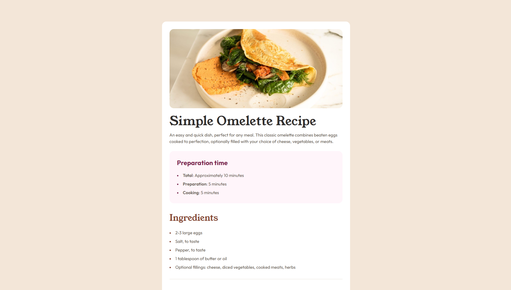

# Frontend Mentor - Recipe page solution

This is a solution to the [Recipe page challenge on Frontend Mentor](https://www.frontendmentor.io/challenges/recipe-page-KiTsR8QQKm). Frontend Mentor challenges help you improve your coding skills by building realistic projects.

## Table of contents

- [Overview](#overview)
  - [The challenge](#the-challenge)
  - [Screenshot](#screenshot)
  - [Links](#links)
- [My process](#my-process)
  - [Built with](#built-with)
  - [What I learned](#what-i-learned)
  - [Continued development](#continued-development)
  - [Useful resources](#useful-resources)
  - [AI Collaboration](#ai-collaboration)
- [Author](#author)
- [Acknowledgments](#acknowledgments)

## Overview

### The challenge

Build a recipe page that matches the provided design as closely as possible, while keeping the layout responsive and accessible across screen sizes.

### Screenshot

### Links

- Live Site URL: [Recipe page](https://huyphan2210.github.io/recipe-page-main/)

## My process

### Built with

- Semantic HTML5 markup
- CSS custom properties
- Flexbox
- Responsive design
- Mobile-first workflow
- JavaScript for subtle in-view animation

### What I learned

This project helped me sharpen my eye for spacing, typography, and color consistency. I practiced turning a static mockup into a responsive layout and learned how to structure semantic content with headings, lists, and tables.

I also improved my understanding of how to use CSS variables for a clean design system and how to make a page feel polished without overusing effects.

### Continued development

I want to keep improving my responsive layout skills, my attention to detail with typography, and my ability to create more polished, accessible front-end interfaces.

### Useful resources

- [MDN Web Docs](https://developer.mozilla.org/) - Helpful for HTML, CSS, and JavaScript fundamentals.
- [CSS-Tricks](https://css-tricks.com/) - Great for learning layout and spacing techniques.
- [Frontend Mentor](https://www.frontendmentor.io/) - Useful for practicing UI implementation and design matching.

### AI Collaboration

I used GitHub Copilot during this project to help structure the HTML and CSS, compare the layout against the design, and quickly test ideas for spacing and styling consistency. It was especially helpful for iterative refinements and debugging.

## Author

- GitHub - [huyphan2210](https://github.com/huyphan2210)
- LinkedIn - [Huy Phan](https://www.linkedin.com/in/huy-phan-7924aa25a/)
- Frontend Mentor - [@huyphan2210](https://www.frontendmentor.io/profile/huyphan2210)

## Acknowledgments

This project was completed as part of the Frontend Mentor recipe page challenge. The design and assets were provided by Frontend Mentor.

